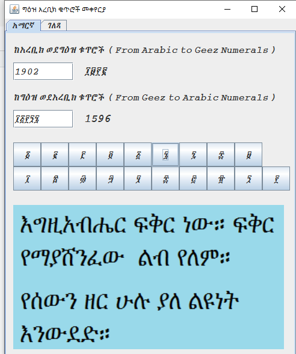

# Geez-Arabic-Numeral-Converter
This proram is a desktop app for converting Geez numbers in the range 1 to 10,000 to Arabic numbers and vice versa.
  
## How to use the app:
To use the app, download this repository and put the Geez-ArabicNumeralConverter.jar excutable file in your computer. It opens when you double click it.
To convert an Arabic numeral to Geez numeral, insert the number in the first input field. The equivalent Geez numeral appears at the right of the input field automatically. 
To convert a Geez numeral to an Arabic numeral, insert the number in the second input field by clicking the buttons below. The equivalent Arabic numeral appears at the right of the second input field automatically.  
 
<em>Screen shot of Geez Arabic Numeral Converter</em>

## Technologies used

- Java 8
- Netbean

## Author

👤 **Desta Legesse Wubishet**

- GitHub: https://github.com/dlwub
- Twitter: [@DestaWubishet](https://twitter.com/DestaWubishet)
- LinkedIn: https://www.linkedin.com/in/desta-legesse-w-509844213/

Give a ⭐️ if you like this project!

&copy; 2016 All rights reserved.
